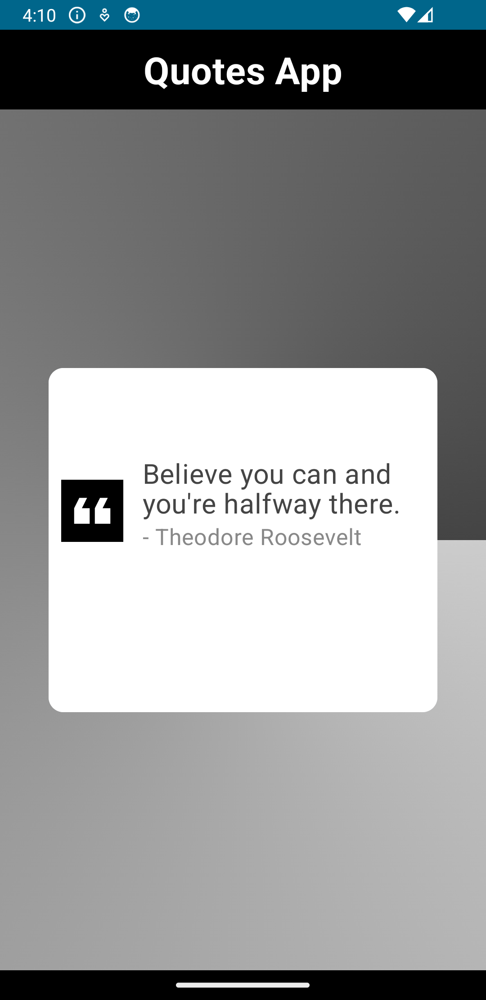

# Compose-Quote-App

## Description

Compose-Quote-App is a simple Android application built with **Jetpack Compose** that reads quotes from a JSON file and displays them in a list. It showcases the usage of Jetpack Compose for building modern UIs in Android applications. The app follows the **MVVM architecture** pattern and utilizes **Hilt Dependency Injection** for efficient and maintainable code. Asynchronous programming is handled using **Coroutines**.

### Technologies Used:

- **Jetpack Compose**
- **MVVM**
- **Hilt Dependency Injection**
- **Coroutines**

Compose-Quote-App showcases best practices in Android development by leveraging these technologies.

## Screenshots

 

## Table of Contents

- [Installation](#installation)
- [Usage](#usage)
- [Contributing](#contributing)
- [License](#license)

## Installation

1. Clone the repository:
git clone https://github.com/rahulgothwal5/Compose-Quote-App.git

2. Open the project in Android Studio.

## Usage

Explore the codebase to learn how to develop an Android application using **Jetpack Compose** for building modern UIs, **MVVM architecture** for structuring the app's codebase, and **Hilt Dependency Injection** for managing dependencies. Asynchronous programming is handled efficiently using **Coroutines**.

## Contributing

1. Fork the repository.
2. Create a new branch (`git checkout -b feature/your-feature-name`).
3. Make your changes.
4. Commit your changes (`git commit -am 'Add new feature'`).
5. Push to the branch (`git push origin feature/your-feature-name`).
6. Create a new Pull Request.

## License

This project is licensed under the [MIT License](LICENSE).
